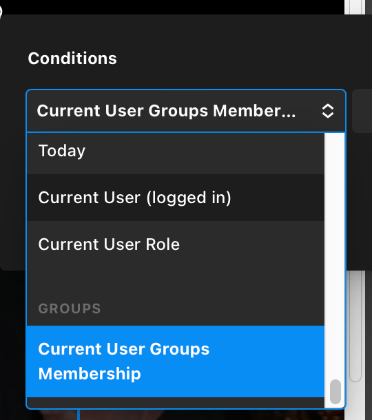
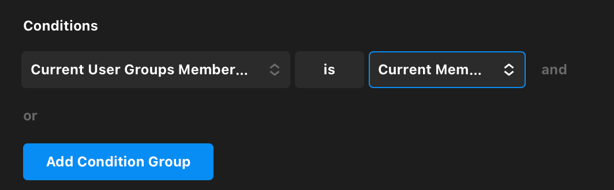

# ASMAC Cornerstone Groups Condition WordPress Plugin

Adds support to use [itthinx Groups](https://github.com/itthinx/groups) group membership in themeco's Cornerstone [conditions and assignments](https://theme.co/docs/conditions-and-assignments).

## Requirements

* WordPress -- tested with WordPress 6.2.2.
* PHP 8.0.28 -- tested with PHP 8.0.28.
* themeco [Cornerstone](https://theme.co/docs/cornerstone-overview) builder -- tested with Cornerstone 7.2.5 using Pro theme 6.2.5.
* itthinx [Groups WordPress plugin](https://wordpress.org/plugins/groups/) -- tested with Groups 2.18.0
* (Optional, but useful): [ASMAC Cornerstone Condition Rules Monitor](https://github.com/asmac-org/asmac-cornerstone-condition-rules-monitor) plugin -- sends email if a condition rule is defined on a page when the rule function no longer exists.

## Installation

1. Upload or extract the `asmac-cornerstone-groups-condition` folder to your site's `/wp-content/plugins/` directory. You can also use the *Add new* option found in the *Plugins* menu in WordPress.  
2. Enable the plugin from the *Plugins* menu in WordPress.

## Usage

Once activated, in the Cornerstone [conditions and assignments](https://theme.co/docs/conditions-and-assignments) area, you'll see a new option: `Current User Groups Membership` with a set of options based on the groups configured in the [Groups](https://docs.itthinx.com/document/groups/setup/groups/) WordPress plugin.

Before writing this plugin, we were using [`[groups_member group="groupname"]`](https://docs.itthinx.com/document/groups/shortcodes/groups_member/) and [`[groups_non_member…]`](https://docs.itthinx.com/document/groups/shortcodes/groups_non_member/) Groups shortcodes wrapped around [Raw Content elements](https://theme.co/docs/raw-content) in Cornerstone. With this plugin enabled, now any element can have a condition based on Groups membership.

## Limitations

At the moment, there's no way to preview with various group membership. That might be added later if feasible with Cornerstone's `preview_contexts`.

## Credits

Written by Jeff Kellem for ASMAC (American Society of Music Arrangers and Composers). Instead of writing up notes of why themeco should add support for Groups, the initial code was written, though the [docs for conditions](https://theme.co/docs/cornerstone-developer-guide#conditions) are lacking.

© 2023 Jeff Kellem 
License: BSD-2-CLAUSE
